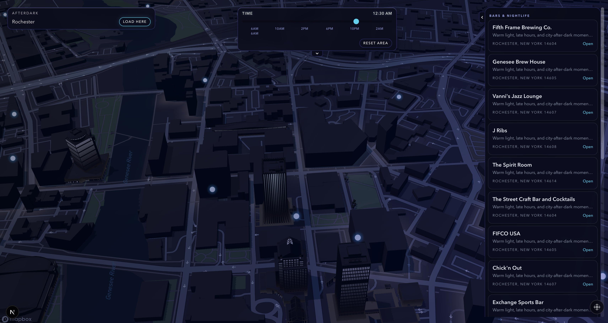

<div align="center">

# AfterDark

**A cinematic, time-aware city discovery app.**
*Time is not a filter — time is the theme engine for the entire interface.*

[](https://nextjs.org)
[](https://typescriptlang.org)
[](https://tailwindcss.com)
[](#deploy-to-aws)
[](https://mapbox.com)

</div>

---

<div align="center">
  
  
</div>
<div align="center">
  
  
</div>
<div align="center">
  
  
</div>

---

## Features

- **4 Time Themes** — Morning, Afternoon, Dusk, Night. The entire UI — map style, colors, cards, gradients — morphs as you drag the time slider.
- **Full-screen Map** — Mapbox GL JS canvas with runtime visual adaptation and smooth theme transitions.
- **Live POI Discovery** — Queries the Mapbox Search API in real time to discover nearby places within the viewport.
- **Smart Ranking** — Places are ranked by open/closed status, tag relevance, and proximity to the user.
- **Tag Filters** — FilterChips for Quiet, Solo, Late Night, Weekend, Cafe, Walkable.
- **Offline-First** — Works entirely without a backend using built-in seed data.
- **Full AWS Deployment** — Ships with an AWS CDK stack for one-command serverless deployment (Lambda + API Gateway). Frontend can be deployed as a static site to S3 + CloudFront.

## Tech Stack

| Layer | Technology |
|-------|-----------|
| Framework | Next.js 15 (React 19) |
| Language | TypeScript 5.8 |
| Styling | Tailwind CSS 3.4 |
| Animation | Framer Motion |
| Map | Mapbox GL JS |
| Backend | AWS Lambda + API Gateway |
| Infra-as-Code | AWS CDK |
| Testing | Vitest |

## Quick Start

```bash
# Install dependencies
npm install

# Create env file
cp .env.example .env.local
```

# Add your Mapbox token (recommended)
# NEXT_PUBLIC_MAPBOX_ACCESS_TOKEN=pk.xxx

# Start dev server
npm run dev
```

Open [http://localhost:3000](http://localhost:3000).

> Without `NEXT_PUBLIC_PLACES_API_URL`, the frontend works offline using built-in seed data.

## Deploy to AWS

AfterDark supports full AWS deployment. The backend ships as an AWS CDK stack, and the frontend exports as a static site ready for S3 + CloudFront.

### Backend — Lambda + API Gateway

```bash
# 1. Install infra dependencies
npm --prefix infra install

# 2. Bootstrap CDK (first time only)
npx cdk bootstrap aws://ACCOUNT_ID/us-east-1

# 3. Deploy
export MAPBOX_ACCESS_TOKEN="pk.your_token"
npm run cdk:deploy
```

CDK outputs the API endpoint:

```
AfterDarkStack.PlacesApiEndpoint = https://abc123.execute-api.us-east-1.amazonaws.com/prod/places
```

### Frontend — Static Export → S3 + CloudFront

```bash
# Point frontend to the deployed API
export NEXT_PUBLIC_PLACES_API_URL="https://abc123.execute-api.us-east-1.amazonaws.com/prod/places"

# Build static export
npm run build:static

# Upload to S3
aws s3 sync out/ s3://YOUR_BUCKET --delete

# Invalidate CDN cache (if using CloudFront)
aws cloudfront create-invalidation --distribution-id YOUR_DIST_ID --paths "/*"
```

> See [DEPLOYMENT.md](DEPLOYMENT.md) for the full deployment guide with architecture diagrams and cost estimates.

## API Reference

`GET /places`

| Param | Type | Description | Default |
|-------|------|-------------|---------|
| `time` | number | Hour of day (0–30 range) | `22` |
| `tags` | string | Comma-separated tags | — |
| `limit` | number | Max results | `40` |
| `lng`, `lat` | number | User location for proximity ranking | — |
| `bbox` | string | `west,south,east,north` — triggers live Mapbox search | — |
| `q` | string | Free-text search | — |

```json
{
  "places": [
    { "id": "...", "name": "...", "vibe": "...", "score": 10.4, "openNow": true }
  ],
  "count": 24
}
```

## Project Structure

```
app/            → Next.js pages & layout
components/     → MapCanvas, PlaceCard, TimeSlider, FilterChip, etc.
shared/         → Types, seed data, time-theme engine, filter/ranking logic
services/api/   → Lambda handler
lib/            → Mapbox discovery & geocoding clients
infra/          → AWS CDK stack (Lambda + API Gateway)
tests/          → Vitest tests
```

## Available Scripts

| Command | Description |
|---------|-------------|
| `npm run dev` | Start local dev server |
| `npm run build:static` | Build static export to `out/` |
| `npm run preview:static` | Preview static build locally (port 4173) |
| `npm run test` | Run tests |
| `npm run cdk:synth` | Synthesize CloudFormation template |
| `npm run cdk:deploy` | Deploy backend to AWS |

## License

MIT
